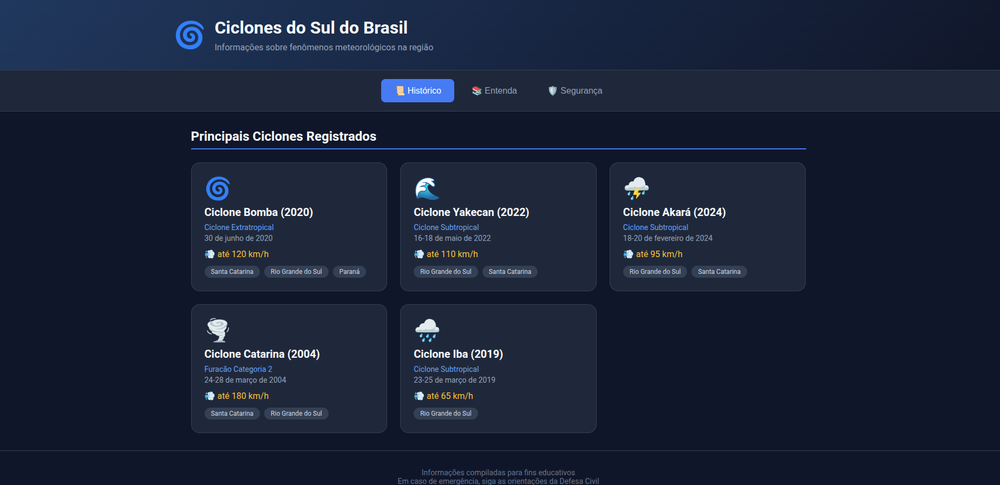

# Ciclones no Sul do Brasil

Este projeto é uma aplicação React que visa fornecer informações e visualizações sobre ciclones no sul do Brasil. Utilizando dados meteorológicos, a aplicação permite aos usuários explorar padrões de ciclones, suas trajetórias e impactos na região sul do país.

## Tecnologias Utilizadas

- **React**: Biblioteca JavaScript para construção de interfaces de usuário, utilizada na versão 19.2.0 para componentes modernos e eficientes.
- **Vite**: Ferramenta de build rápida e leve para desenvolvimento frontend, com suporte a Hot Module Replacement (HMR) para uma experiência de desenvolvimento ágil.
- **ESLint**: Ferramenta de linting para manter a qualidade do código JavaScript/React, configurada com regras específicas para React.
- **TypeScript**: Tipagem estática opcional através de tipos para React (@types/react e @types/react-dom), melhorando a robustez do código.

## Funcionalidades

- Visualização interativa de dados de ciclones
- Interface responsiva para desktop e mobile
- Atualizações em tempo real com HMR durante o desenvolvimento

## Como Executar

### Pré-requisitos

- Node.js (versão recomendada: 18+)
- pnpm (gerenciador de pacotes)

### Instalação

1. Clone o repositório:
   ```bash
   git clone https://github.com/DarioCampagnaCoutinho/ciclones-sul-brasil.git
   cd ciclones-sul-brasil
   ```

2. Instale as dependências:
   ```bash
   pnpm install
   ```

3. Execute o servidor de desenvolvimento:
   ```bash
   pnpm dev
   ```

4. Abra o navegador em `http://localhost:5173` para visualizar a aplicação.

### Build para Produção

Para gerar uma versão otimizada para produção:
```bash
pnpm build
```

Para visualizar a versão de produção localmente:
```bash
pnpm preview
```

## Scripts Disponíveis

- `pnpm dev`: Inicia o servidor de desenvolvimento
- `pnpm build`: Compila a aplicação para produção
- `pnpm lint`: Executa o ESLint para verificar o código
- `pnpm preview`: Serve a versão de produção localmente

## Implantação

Este projeto está implantado na AWS Amplify para facilitar o acesso e a distribuição. Você pode acessar a versão ao vivo através do link fornecido pelo Amplify após a implantação.

### Configuração do Build (amplify.yml)

O arquivo `amplify.yml` na raiz do projeto configura o processo de build no AWS Amplify. Ele instrui o Amplify a usar o pnpm (em vez do npm padrão) para gerenciar dependências e builds, garantindo consistência com o ambiente de desenvolvimento local.

Principais configurações:
- **preBuild**: Habilita o corepack, prepara o pnpm e instala as dependências com `pnpm install`.
- **build**: Executa o comando `pnpm run build` para compilar a aplicação.
- **artifacts**: Define o diretório `dist` como base para os arquivos de produção.
- **cache**: Cacheia o `node_modules` para acelerar builds subsequentes.

Para implantar sua própria versão no AWS Amplify:

1. Faça o build da aplicação localmente: `pnpm build`
2. Conecte o repositório ao AWS Amplify Console
3. O Amplify detectará automaticamente o `amplify.yml` e usará as configurações definidas

## Contribuição

Contribuições são bem-vindas! Sinta-se à vontade para abrir issues ou pull requests.

## Licença

Este projeto está sob a licença MIT.


